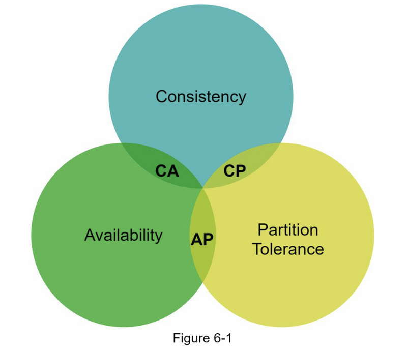
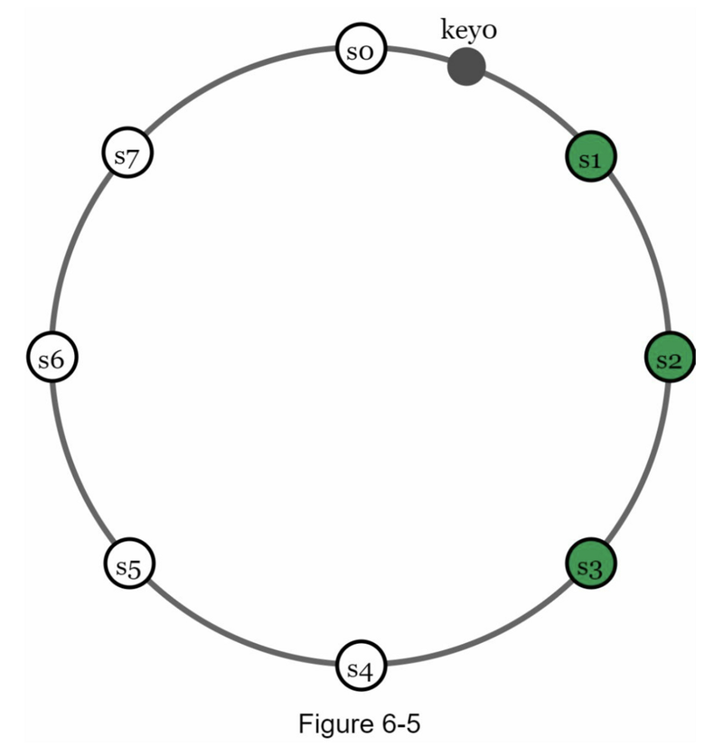
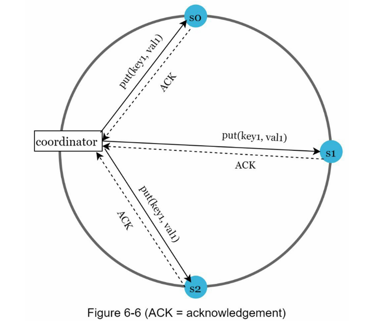
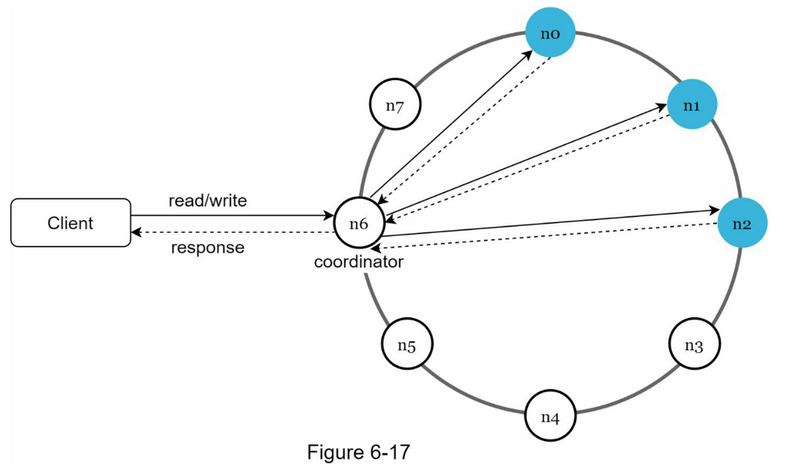
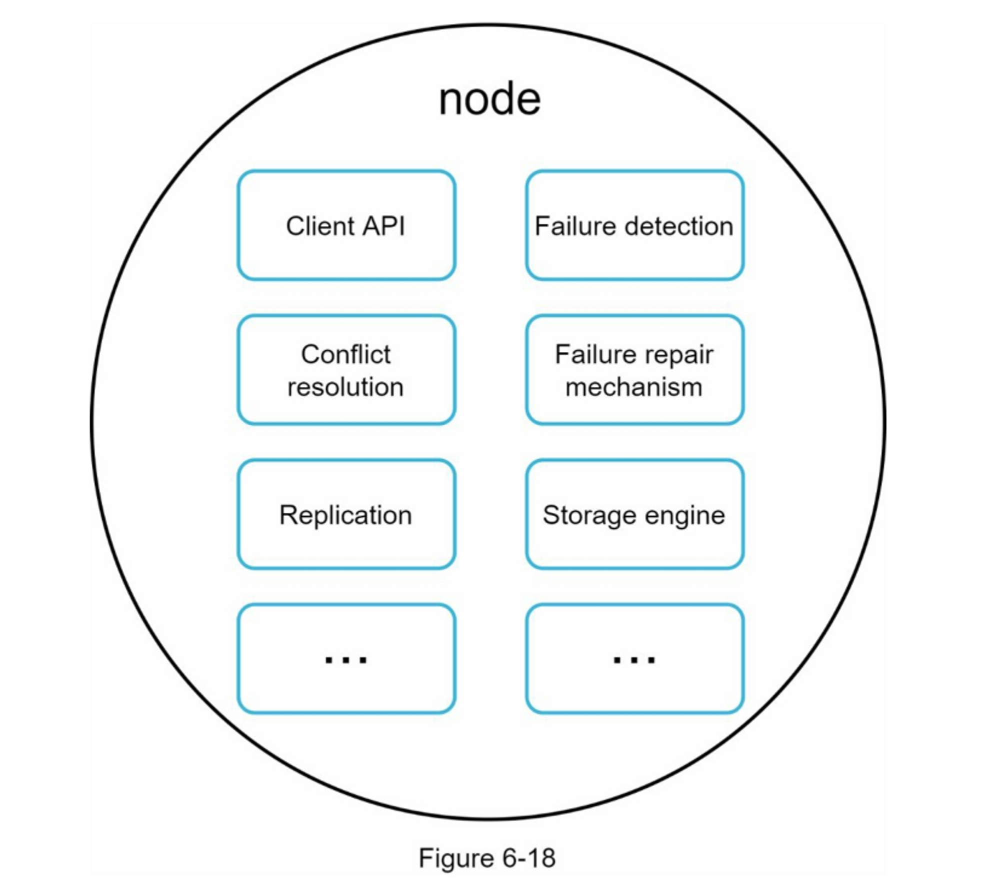
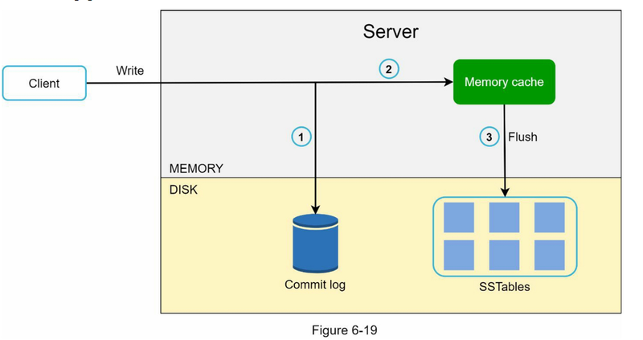
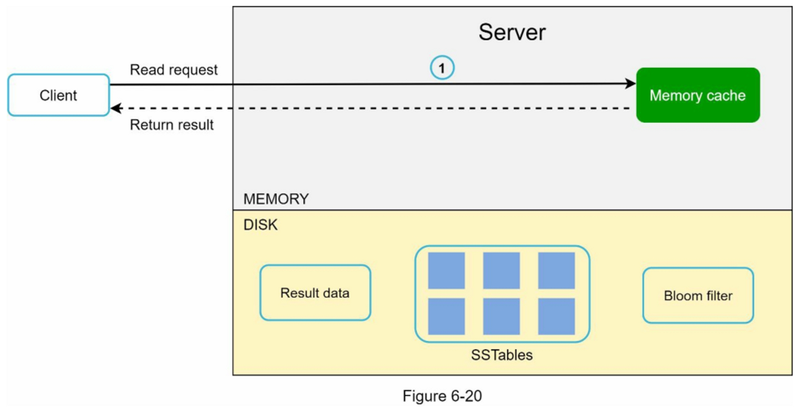
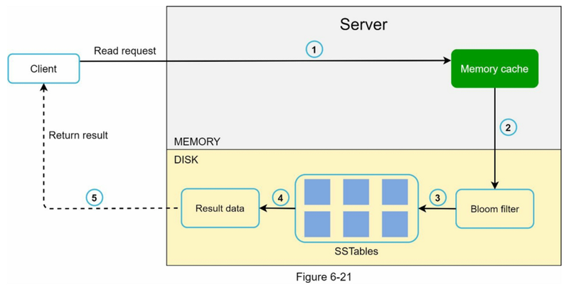

# key-value存储设计

## 确定需求

- 键值对的大小很小：不到 10 KB。
- 有能力存储大数据。
- 高可用性：系统响应迅速，即使在出现故障时也是如此。
- 高可扩展性：系统可以扩展以支持大数据集。
- 自动缩放：服务器的添加/删除应该根据流量自动进行。
- 可调节的一致性。
- 低延迟。

**单一服务器**：将键值对存储在哈希表中，该哈希表将所有内容保存在内存中。
**分布式哈希表**：它将键值对分布在许多服务器上

**CAP定理**：不可能三角

**一致性** C：一致性意味着所有客户端无论连接到哪个节点，都在同一时间看到相同的数据。
**可用性** A：可用性意味着即使某些节点已关闭，任何请求数据的客户端都会得到响应。
**分区容忍度** P：分区表示两个节点之间的通信中断，分区容错意味着系统在网络分区的情况下继续运行。

## 系统组件

- 数据分区
- 数据复制
- 一致性
- 不一致解决方案
- 故障处理
- 系统架构图
- 写入路径
- 读取路径

### 数据分区

要求：
- 跨多个服务器平均分配数据。
- 当节点被添加或删除时，尽量减少数据移动。

解决办法： **一致性哈希**（哈希环）

优点：
- 自动缩放：可以根据负载自动添加和删除服务器
- 异构性：服务器的虚拟节点数与服务器容量成正比。例如，容量越大的服务器分配的虚拟节点越多。

### 数据复制

在 N 个服务器上异步复制数据，其中 N 是一个可配置参数。这N台服务器的选择逻辑如下：将key映射到哈希环上的某个位置后，从该位置顺时针走，选择环上的前N台服务器存储数据副本

N = 3，key0 被复制到 s1、s2 和 s3

### 一致性

Quorum consensus: 保证读写一致性

$N$ = The number of replicas

$W$ = A write quorum of size W. For a write operation to be considered as successful, write operation must be acknowledged from W replicas. 

$R$ = A read quorum of size R. For a read operation to be considered as successful, read operation must wait for responses from at least R replicas.

上图 W=1, N=3, 数据被复制到 s0、s1 和 s2。 W = 1 表示协调器必须至少收到一个确认才能认为写操作成功。如果我们收到来自 s1 的确认，我们就不再需要等待来自 s0 和 s2 的确认。 协调器充当客户端和节点之间的代理

W = 1 或R = 1： 低延迟，只用等待一个副本响应
W 或 R > 1： 系统提供更好的一致性，但会更慢
W+R>N，就能保证强一致性

可能的设置：
- 如果R=1，W=N，系统被优化为快速读取
- 如果W=1，R=N，系统被优化为快速写入
- 如果W+R>N，就可以保证强一致性（通常N=3，W=R=2）。
- 如果W+R<=N，则不能保证强一致性

### 不一致的解决方法：版本控制

### 故障处理

## 系统架构

- 客户端通过简单的API与键值存储通信：get(key)和put(key, value)。
- 协调器是一个节点，在客户端和键值存储之间充当代理。
- 节点采用一致性hash的散列方式分布在一个环上。
- 该系统是完全去中心化的，所以添加和移动节点可以自动进行。
- 数据在多个节点上复制。
- 不存在单点故障，因为每个节点都有相同的职责。

每一个节点都执行以下任务：

## 写入

1. 写入请求持久保存在提交日志文件中。
2. 数据保存在内存缓存中。
3. 当内存缓存已满或达到预定义的阈值时，数据将刷新到磁盘上的 SSTable

## 读取

首先检查数据是否在内存缓存中。如果是，数据就会被返回给客户端

如果数据不在内存中，就会从磁盘中检索出来。我们需要一个有效的方法来找出哪个SSTable中包含了该键。**布隆过滤器**[10]通常被用来解决这个问题。
