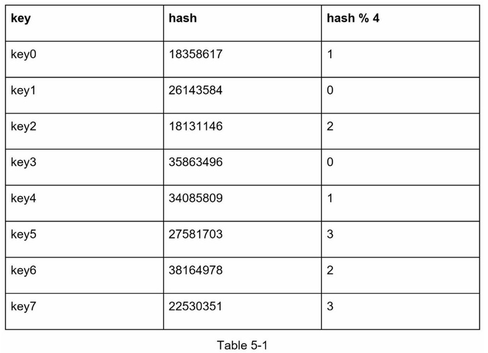
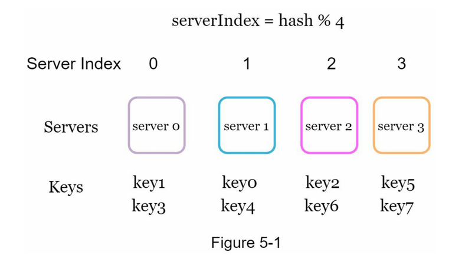
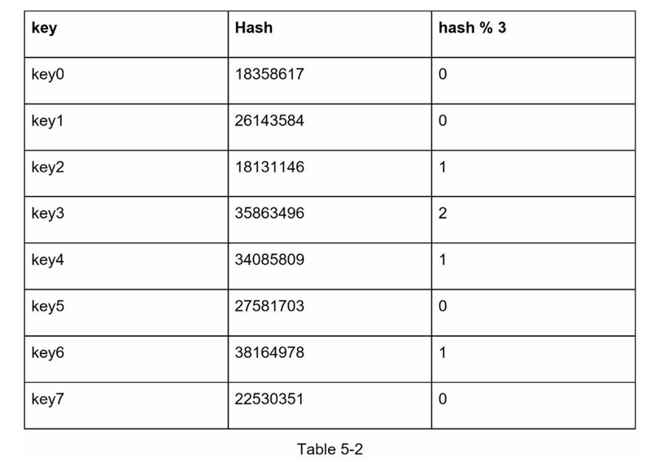
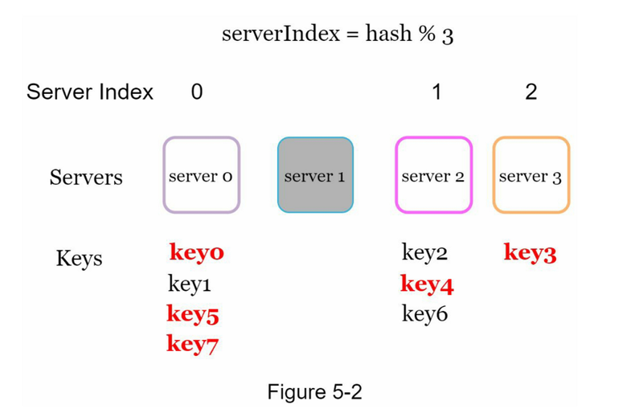

%% TODO %%
# 一致性hash设计

用于均匀分配请求、数据到分布负载服务器

## 问题起源：再哈希问题 rehashing
如果你有n个缓存服务器，平衡负载的一个常用方法是使用以下哈希方法：
`serverIndex = hash(key) % N`，其中N是服务器池的大小

得到哈希到服务器的映射关系如下，是均衡的：

但如果有一台服务器下线，N=3，则同一组哈希取余如下：

导致大多数键都被重新分配，而不仅仅是最初存储在脱机服务器（服务器1）中的键，大多数缓存客户会连接到错误的服务器来获取数据，这就造成了高速缓存失误的风暴

## 一致性哈希

> 一致性哈希是一种特殊的哈希，当重新调整哈希表的大小并使用一致性哈希时，**平均只需要重新映射 k/n 个键**，其中 k 是键的数量，n 是槽的数量。 相比之下，在大多数传统的哈希表中，数组槽数量的变化导致几乎所有键都被重新映射

## 哈希空间&哈希环

TODOs