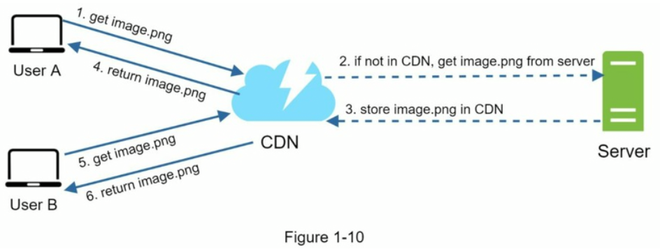

## 基本架构：单服务器

## 数据库

**关系型数据库 RDBMS**：MySQL, PostgreSQL， 使用表格和行来表示和存储数据
**非关系型数据库 NOSQL**
键值存储、图存储、列存储和文档存储

- 你的应用程序需要超低延迟
- 你的数据是非结构化的，或者你没有任何关系型数据。
- 你只需要序列化和反序列化数据（JSON、XML、YAML等）。
- 你需要存储大量的数据

### 垂直扩展vs水平扩展

垂直扩展，又称为“纵向扩展”，指的是通过增加单个服务器的计算能力（CPU、RAM等）来提升其性能。

水平扩展，又称为“横向扩展”，允许通过向资源池中添加更多服务器来进行扩展。

## 负载均衡

- 如果服务器1下线，所有流量将被路由到服务器2。这可以防止网站离线，我们还将在服务器池中添加一个新的健康Web服务器来平衡负载。
- 如果网站流量迅速增长，并且两台服务器不足以处理流量，那么负载均衡可以很好的处理这个问题，你只需要向web服务器池中添加更多的服务器，负载均衡会自动发送请求给他们。

## 数据库复制

**基本假设：读比写多**

master/slave DB:
master DB: WRITE only
slave DB: 从master复制数据，READ only，增删改命令发到master

- **更好的性能**：在这个主/从模型中，所有的写入和更新都发生在主节点，而所有的**读操作分布在从节点**。这种模型提高了性能，因为它允许**并行处理**更多的查询。
- **可靠性**：如果你的其中一台数据库被台风、地震等自然灾害破坏，数据仍然会被保留。你无需担心数据丢失，因为**数据被复制到多个位置**。
- **高可用性**：通过在不同位置复制数据，即使一台数据库离线，你的网站仍然可以运行，因为你可以访问存储在另一个数据库服务器中的数据。

e.g. 负载均衡+数据库复制的系统：

## 缓存

临时存储，比DB快

- 当数据频繁读取但不经常修改时，请考虑使用缓存
- 设置过期策略
- 保持DB和缓存一致性
- 建议在不同数据中心使用多个缓存服务器，以避免单点故障(SPOF)

## CDN

当用户访问一个网站时，距离用户最近的CDN服务器将提供静态内容：减少延迟

## 无状态的web层

将用户会话数据（登录状态，头像等）放在shared storage，用户可以访问任何一个web server，从共享shared storage拿到用户回话状态

## 数据中心

用户通过**geoDNS**路由(也称为地理路由)到最近的数据中心，美国东部的流量为x%，美国西部的流量为(100-x)%。geoDNS是一种DNS服务，允许根据用户的位置将域名解析为IP地址。

发生任何重大数据中心中断的情况下，我们将所有流量引导到一个健康的数据中心

## 消息队列

一个持久的组件，存储在内存中，支持异步通信，它充当缓冲区并分发异步请求
发布、订阅

示例：你的应用程序支持照片自定义，包括剪裁、锐化、模糊等。这些定制任务需要一些时间才能完成。在图1-18中，Web服务器将照片处理作业发布到消息队列。照片处理工作者从消息队列中获取作业并**异步执行**照片定制任务。生产者和消费者可以**独立扩展**，当队列的大小变得很大时，添加更多的工作者以减少处理时间。但是，如果队列大部分时间为空，则可以减少工作者的数量

## 日志记录、指标、CI/CD

- 主机级别的指标：CPU、内存、磁盘I/O等
- 聚合级别的指标：例如，整个数据库层、缓存层的性能
- 关键业务指标：每日活跃用户、留存数、收入等

## 最终示例

