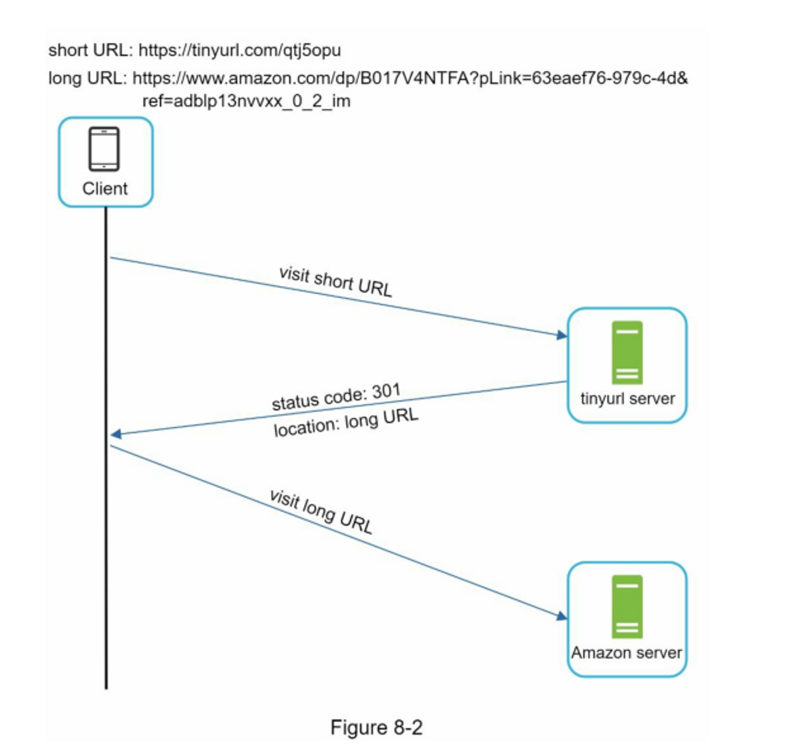
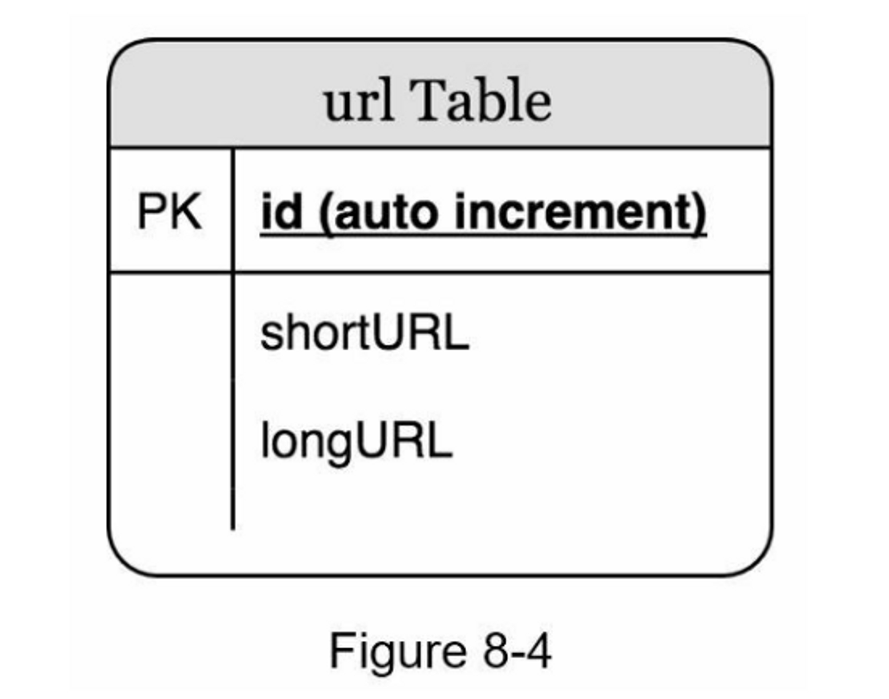
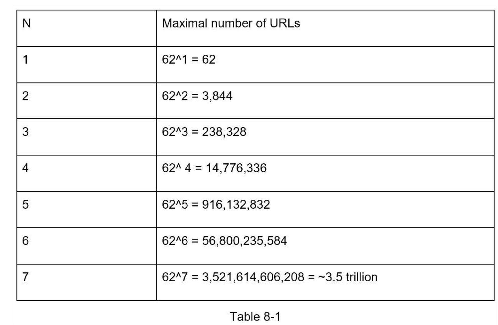
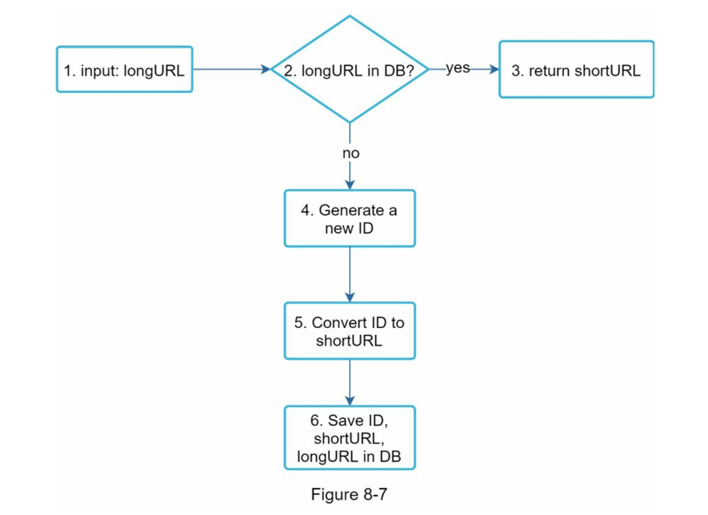
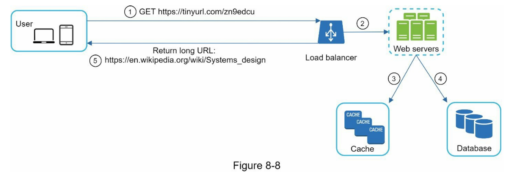

# 短网址设计
## 需求

设计一个像tinyurl一样的URL缩短服务

1. URL缩短：给定一个长的URL => 返回一个短得多的URL
2. URL重定向：给定一个短的URL => 重定向到原来的URL
3. 高可用性、可扩展性和容错考虑

每天1亿url：
- 写操作：每天产生1亿个URL。
- 每秒写操作：亿/24/3600 = 1160
- 读操作：假设读操作和写操作的比例为10:1，读每秒操作：1160 * 10 = 11,600
- 假设 URL 缩短服务将运行 10 年，这意味着我们必须支持 1 亿 * 365 * 10 = 3650 亿条记录。
- 假设平均 URL 长度为 100。
- 10 年的存储需求：3650 亿 * 100 字节 * 10 年 = 365 TB

hashValue由\[0-9, a-z, A-Z\]中的字符组成
## 高层次设计

### API endpoint

网址缩短：
**POST api/v1/data/shorten**
- 请求参数：{longUrl: longURLString}。
- 返回 shortURL

URL重定向
**GET api/v1/shortUrl**
- 返回用于HTTP重定向的 longURL

### URL redirect

浏览器里输入tinyURL -> 301 redirect -> long url

**301 & 302 区别：**
- **301重定向**。301重定向表明，请求的URL被 "永久 "地移到了长URL上。由于是永久重定向，**浏览器会缓存响应**，对同一URL的后续请求将不会被发送到URL缩短服务上。相反，请求将直接被重定向到长网址服务器。（**减少服务器负载**）
	
- **302重定向**。302重定向意味着URL被 "暂时 "移到长URL上，这意味着对同一URL的后续请求将首先被发送到URL缩短服务上。然后，它们会被重定向到长网址服务器。（更容易地**跟踪点击率和点击的来源**）

### 缩短网址

找到哈希函数 -> `www.tinyurl.com/{hashValue}`
- 每个longURL必须被散列成一个hashValue。
- 每个hashValue都可以被映射回longURL。

## 深入设计

### 数据库

将<shortURL, longURL>映射存储在一个关系数据库中
简化版的表包含3列：id、shortURL、longURL。

### 选择哈希函数

#### 哈希值的长度

哈希长度由需要存储的url总量决定
hashValue 的长度和它可以支持的相应的最大 URL 数：

n = 7时，62 ^ n = ~3.5万亿，3.5万亿足以容纳3650亿个URL

#### 哈希方法选择

| 哈希+碰撞解决                    | base  转换                                      |
| -------------------------- | --------------------------------------------- |
| 固定短URL长度                   | 短URL长度不固定，它随着 id 变化                           |
| 不需要唯一ID生成器                 | 该选项依赖于唯一ID生成器                                 |
| 可能出现冲突，必须解决                | 碰撞是不可能的，因为 ID 是唯一的                            |
| 不可能计算出下一个可用的短网址，因为它不依赖于ID。 | 如果新条目的 ID 递增 1，则很容易找出下一个可用的短 URL。 这可能是一个安全问题。 |

### URL缩短流程 

假设选择base 62 转换

### URL 重定向流程

由于读取多于写入，<shortURL, longURL> 映射存储在缓存中以提高性能

