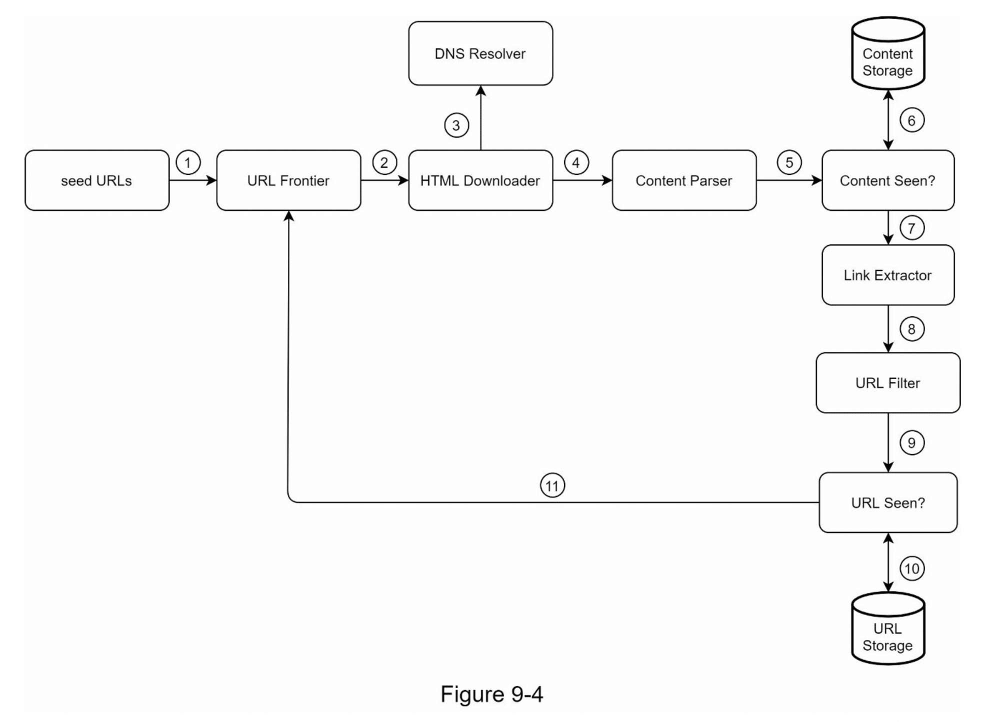
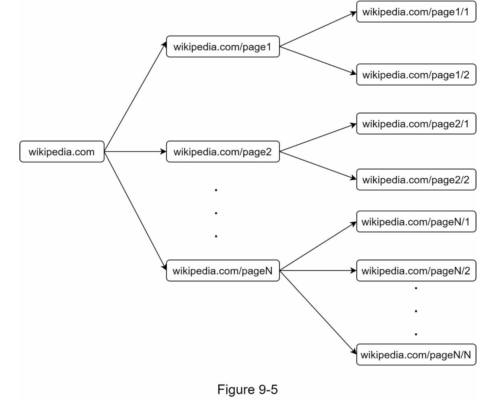
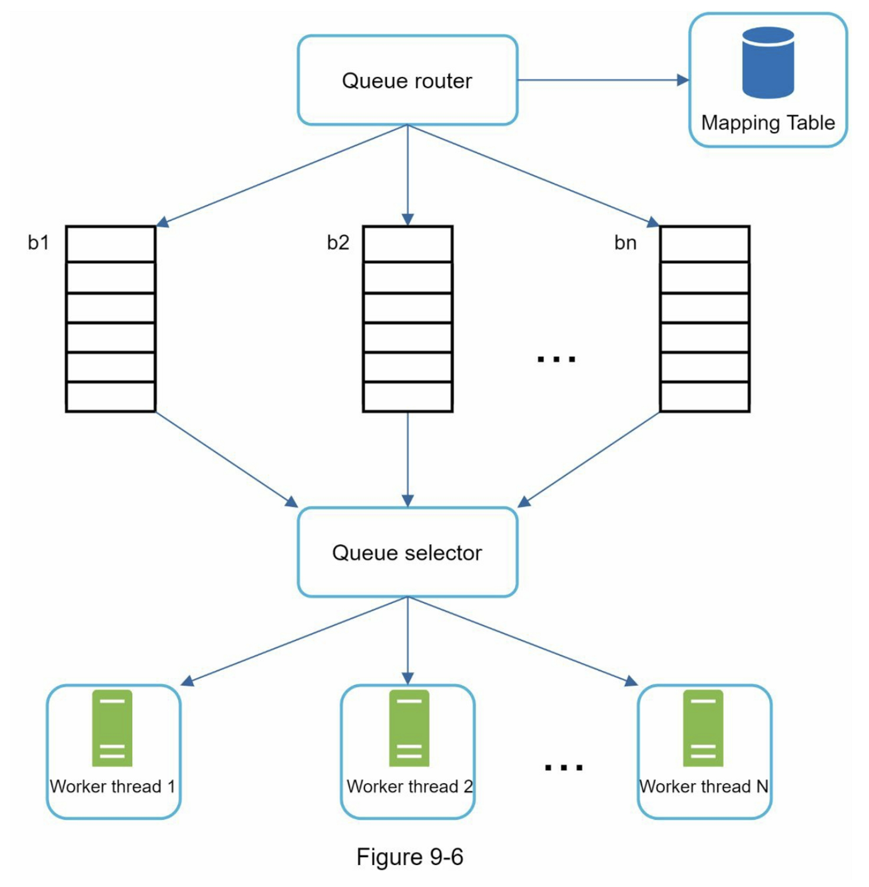
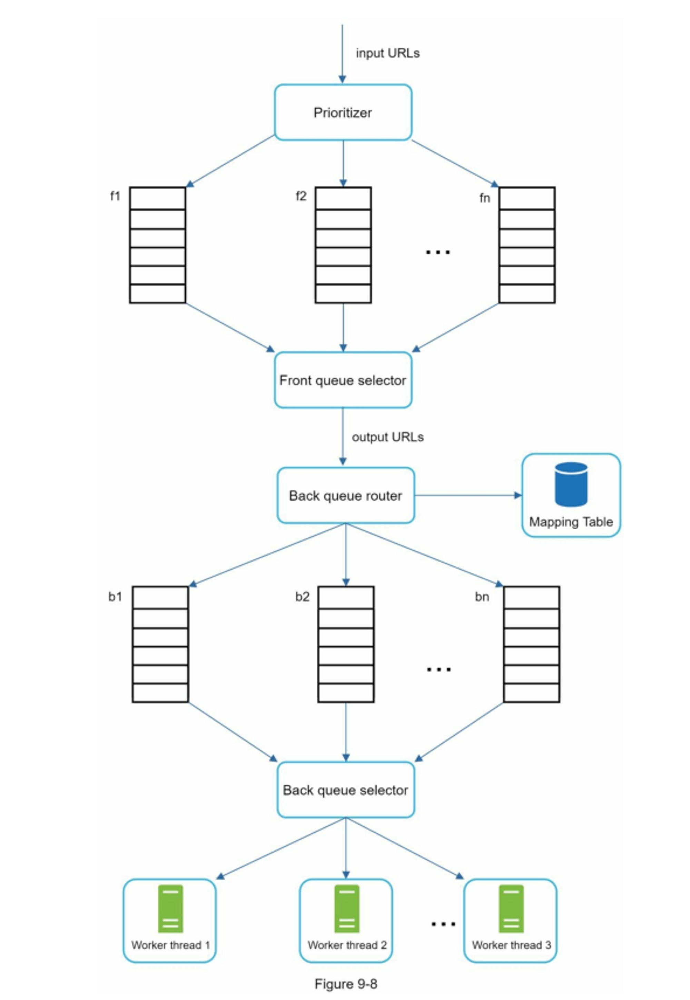
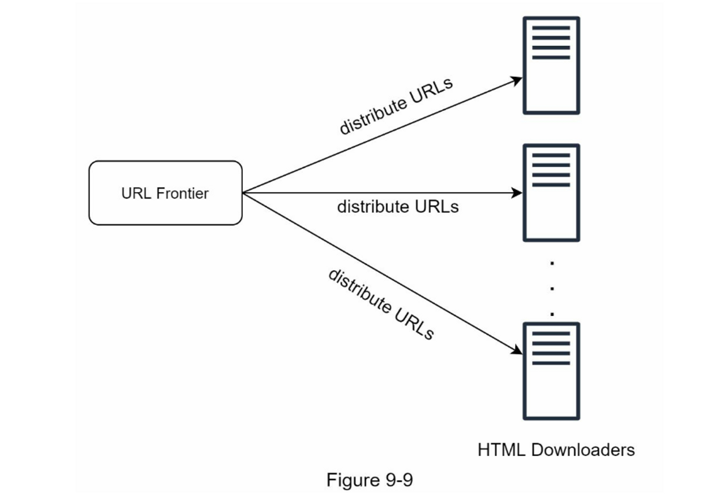
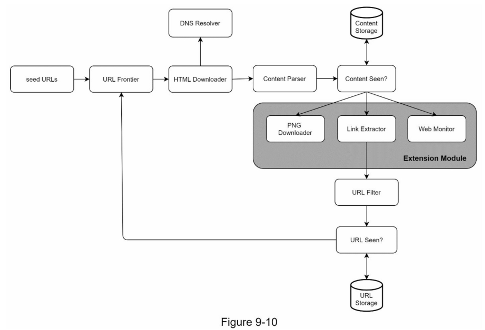

# 网络爬虫设计

爬虫用途：搜索引擎索引，网络存档，网络挖掘数据，网络监控
步骤：
- 给定一组URLs，下载所有由URLs指向的网页。
- 从这些网页中提取 URL。
- 将新的 URL 添加到要下载的 URL 列表中。重复这3个步骤。
## 需求

搜索引擎索引
每月10亿页
html
考虑新添加或编辑的网页
存储5年
忽略重复页面

scalability, robustness, politeness, extensibility

### 估算

- 假设每月下载 10 亿个网页。
- QPS：1,000,000,000 / 30 天 / 24 小时 / 3600 秒 = ~400 页/秒。
- 峰值 QPS = 2 * QPS = 800
- 假设平均网页大小为 500k
- 10 亿页 x 500k = 每月 500 TB 存储空间。如果您对数字存储单元不清楚，请重新阅读第 2 章中的“2 的幂”部分。
- 假设数据存储五年，500 TB * 12 个月 * 5 年 = 30 PB。需要 30 PB 的存储来存储五年的内容。

## 高层次设计

**seed URL**： 爬虫起点
**URL Frontier**: 存储待下载URL的FIFO队列
**HTML Downloader**
**DNS Resolver**
**Content Parser**: 解析验证下载的网页，会减慢爬网过程
**Content Seen?**: 消除重复网页（检查哈希）
**Content Storage**：大部分在磁盘，常用部分在内存
**URL Extractor**： 从 HTML 页面解析和提取链接
**URL Filter**： 排除某些内容类型、文件扩展名、错误链接和“黑名单”站点中的 URL。
**URL Seen**： 避免多次添加相同的URL，服务器负载，无限循环
**URL Storage**： 存储已经访问过的 URL

## 深入设计

- 深度优先搜索 (DFS) 与广度优先搜索 (BFS)
- URL Frontier
- HTML Downloader
- 鲁棒性（Robustness）
- 可扩展性（Extensibility）
- 检测并避免有问题的内容

### 遍历：BFS

1. 来自同一网页的大多数链接都链接回同一主机，导致向同一主机请求过多 （礼貌）
2. 没有考虑url优先级

### URL Frontier
确保礼貌、URL 优先级和新鲜度
#### 礼貌

一次从同一主机下载一个页面。可以在两个下载任务之间添加延迟

- Queue router：它确保每个队列（b1，b2，... bn）仅包含来自同一主机的 URL。
- Mapping table:：它将每个主机映射到一个队列
    
    
- FIFO 队列 b1、b2 到 bn：每个队列包含来自同一主机的 URL。
- Queue selector：每个工作线程都映射到一个 FIFO 队列，它只从该队列下载 URL。队列选择逻辑由Queue selector完成
- Worker thread 1 t到 N：一个工作线程从同一台主机上一个接一个地下载网页，可以在两个下载任务之间添加延迟。

#### 优先级

根据实用性对 URL 进行优先级排序，这可以通过 PageRank [10]、网站流量、更新频率等来衡量

- Prioritizer：它将 URL 作为输入并计算优先级。 •
- Queue f1 到 fn:：每个队列都有一个分配的优先级。优先级高的队列被选中的概率更高。
- Queue selector：随机选择一个偏向于具有更高优先级的队列

两个模块：前端负责优先级，后端负责礼貌

### HTML 下载器

robots.txt 网站与爬虫协商规则

**性能优化**：
1. 分布式抓取
	抓取工作被分配到多个服务器，每个服务器运行多个线程
	
	
2. 缓存DNS解析器
3. 按地理位置分布爬虫服务器
4. 设定超时时间

### 鲁棒性

一致性哈希：帮助分配负载
保存爬虫状态和数据：重启中断
异常处理
数据校验

### 可扩展性

