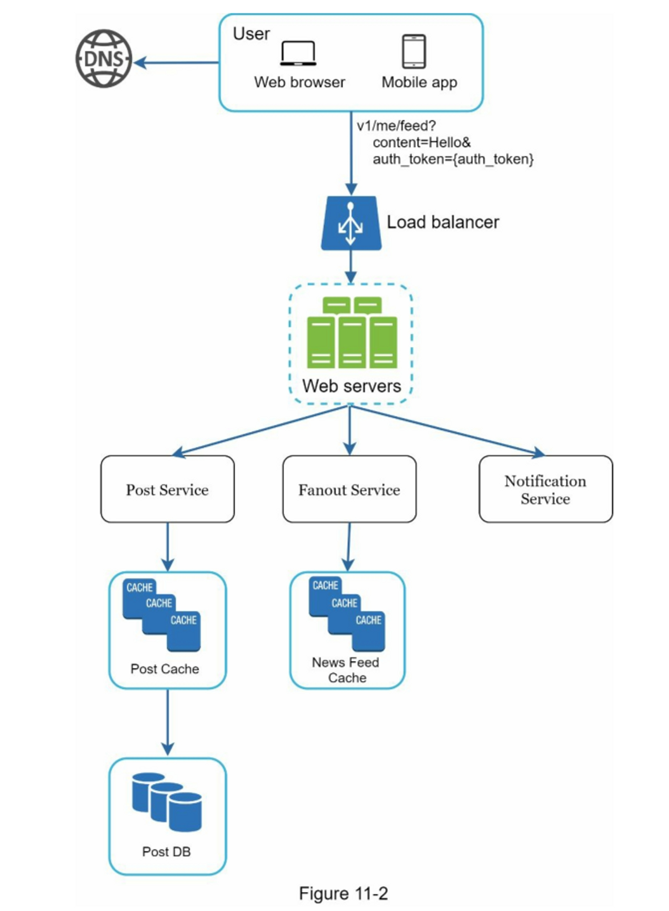
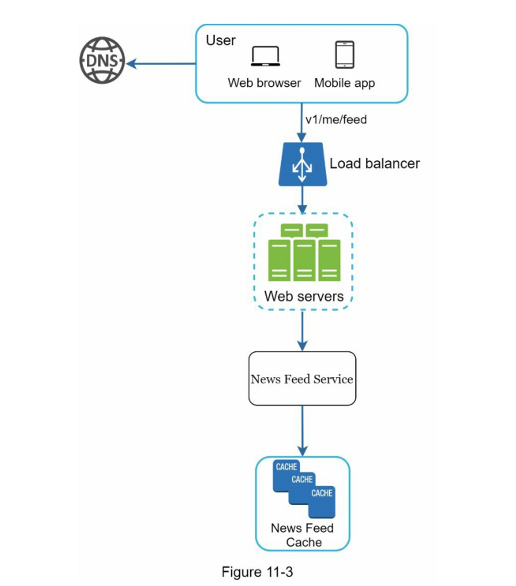
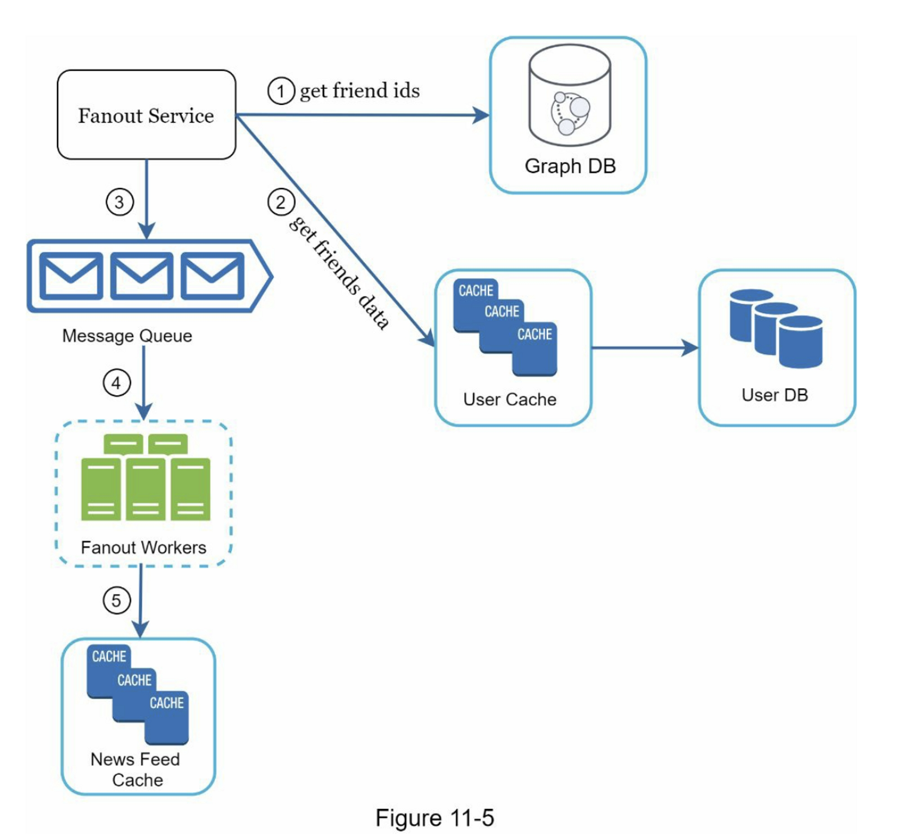
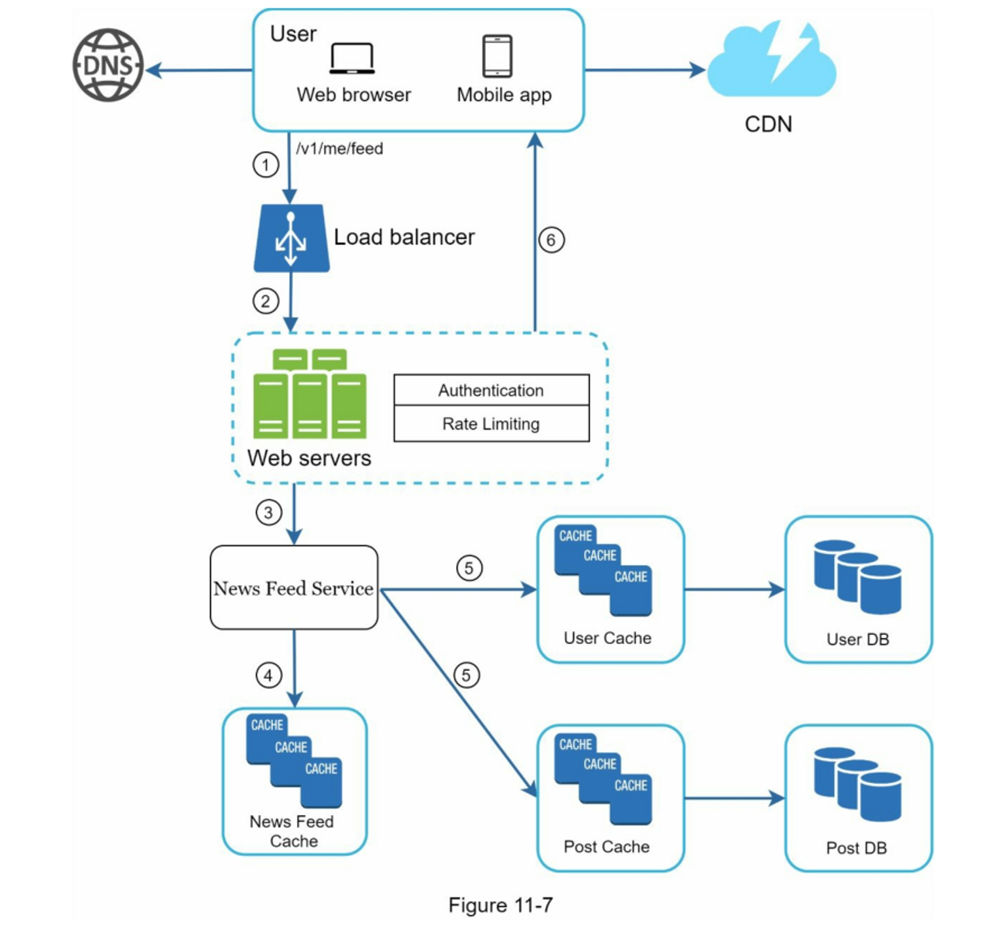
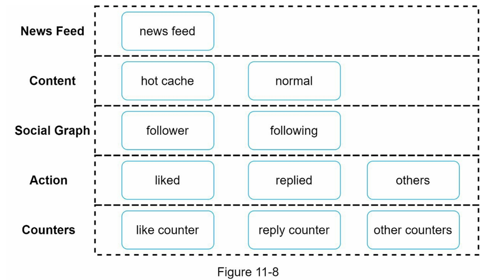

# 设计一个新闻提要系统（newsfeed）

## 需求

移动端+web
发帖，看到好友帖子
排序方式：时间近到远排序
每个用户最多5000好友
流量1000万DAU
包含图片视频

## 高层次设计

两个流程：
- 信息发布（Feed publishing）：当用户发布帖子时，相应的数据被写入缓存和数据库。帖子被推送到她朋友的动态中。
    
- 信息流构建（Newsfeed building）：为简单起见，我们假设信息推送是通过按时间倒序聚合朋友的帖子来构建的。

### API

**信息流发布 API：**
`POST /v1/me/feed`
参数：
- content：帖子内容的文本。
- auth_token：它用于验证API请求。

**信息流检索 API**
`GET /v1/me/feed`
参数：
- auth_token：它用于验证API请求。

### 信息发布 (Feed publishing）

- Post service（帖子服务）：在数据库和缓存中持久保存帖子。
- Fanout service（扇出服务）：推送新内容到朋友的信息流。信息流数据存储在缓存中，以便快速检索。
- 通知服务：通知朋友有新内容，并发送推送通知。

### 信息流构建（Newsfeed building）

- Newsfeed service（信息馈送服务）：fetches news feed from the cache.
- Newsfeed cache（信息流缓存）：store news feed IDs needed to render the news feed.

## 深入设计

### 信息发布：Web server & fanout service

#### web servers
与客户端通信
鉴权
速率限制

#### Fanout service
将帖子传递给所有朋友的过程

##### **写扇出（也称为推模型）fanout on write**
信息流被预先计算
优点：
- 动态消息是实时生成的，可以第一时间推送给朋友。
- 获取信息流的速度很快，因为信息流是在写的时候预先计算的。
缺点：
- 如果一个用户有很多朋友，获取朋友列表并为所有朋友生成信息流是很慢的，而且很耗时间。这被称为**热键**问题。
- 对于不活跃的用户或那些很少登录的用户，预先计算的信息流会浪费计算资源。

##### **读扇出（也称为拉模型）fanout on read**
当用户加载她的主页时，最近的帖子被拉出
优点：
- 对于不活跃的用户或那些很少登录的用户，读取时的扇出效果更好，因为它不会在他们身上浪费计算资源。
- 数据不会被推送给朋友，所以不存在热键的问题。
缺点：
- 获取信息源的速度很慢，因为信息源不是预先计算的。

##### **混合方法**

对大多数用户使用推送模式。对于名人或有很多朋友/粉丝的用户，我们让粉丝按需提取信息内容以避免系统过载

1. get friend ID from GraphQL
2. 用户缓存中获取朋友信息，根据用户设置过滤朋友 （比如被屏蔽用户，分组消息）
3. 将好友列表和新帖子 ID 发送到消息队列。
4. Fanout worker 从消息队列中获取数据并将信息流数据存储在信息流缓存中。
5. 信息流缓存：<post_id, user_id>结构的映射表

### 信息流获取

1. 用户请求信息流 GET /v1/me/feed
2. 负载均衡
3. web server调用news feed service获取feed stream
4. news feed service 从new feed cache获取帖子id列表
5. news feed还包含用户信息，帖子具体信息和图片，从user cache，post cache获取
6. 整合以上信息生成信息流（JSON），返回至客户端

#### 缓存架构

