# 设计一个聊天系统

## 需求

支持1对1和群聊
手机+web
5000万DAU
群最大100人
1对1聊天，群聊，在线状态。系统只支持文本信息
文本长度小于100,000
永久保留记录

## 高层次设计

聊天服务需要支持：
- 接收来自其他客户端的信息。
- 为每条信息找到合适的收件人，并将信息转达给收件人。
- 如果一个收件人不在线，就在服务器上保留该收件人的信息，直到她在线。

发送和接受信息：websocket
其他功能可用http

### 基本架构

聊天系统被分成三大部分：无状态，有状态，第三方

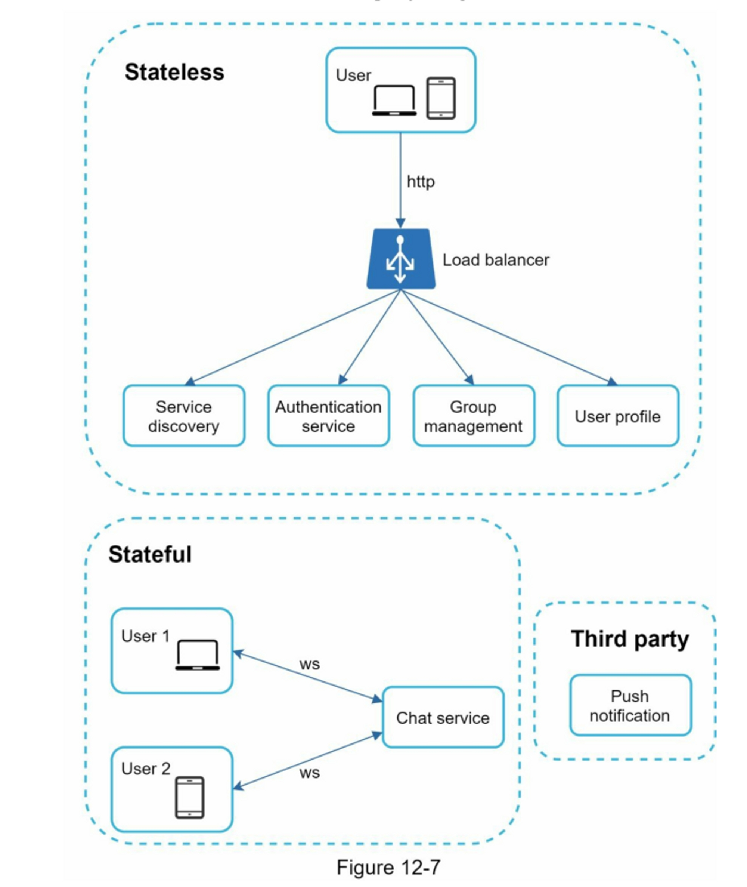

**无状态服务**：管理登录、注册、用户资料等，位于负载均衡器后面，可以是第三方的微服务集成
重要部分：**服务发现**，给客户提供一个客户可以连接到的聊天服务器的DNS主机名列表

**有状态服务**：聊天服务。有状态：每个客户都与一个聊天服务器保持持久的网络连接

**第三方**：推送通知

基本设计：
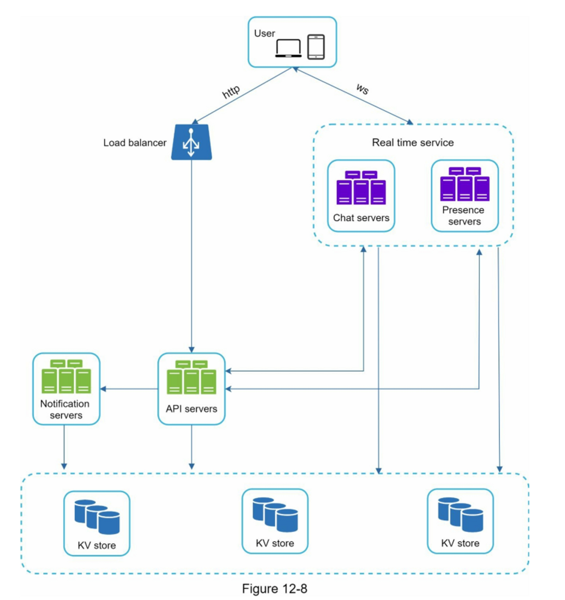
- 聊天服务器促进了信息的发送/接收。
- 在线服务器管理在线/离线状态。
- API服务器处理一切，包括用户登录、注册、更改资料等。
- 通知服务器发送推送通知。
- 最后，键值存储用于存储聊天历史。当一个离线用户上线时，她会看到她以前所有的聊天历史。

### 存储

典型的聊天系统中存在两类数据
1. 通用数据：用户资料、设置、用户朋友列表
2. 聊天历史数据。了解读/写模式很重要

聊天历史数据特点：
1. 数据量巨大
2. 最近的聊天记录频繁访问，旧的不常用
3. 需支持搜索查找
4. 私聊读写比1:1

基于以上特点，使用**键值存储**：
- 键值存储允许容易的水平扩展。
- 键值存储为访问数据提供了非常低的延迟。
- 关系型数据库不能很好地处理长尾[3]的数据。当索引变大时，随机访问是很昂贵的。
- 键值存储被其他成熟可靠的聊天应用程序所采用。例如，Facebook 和 Discord 都使用键值存储。Facebook 使用 HBase[4]，而 Discord 使用 Cassandra[5]。

### 数据模型

**私聊**
主键是message_id，有助于决定消息的顺序
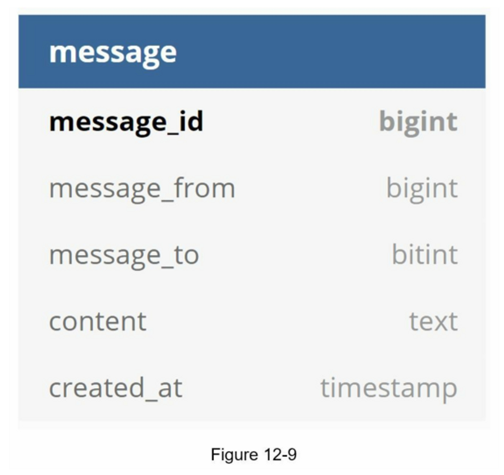

**群聊**
复合主键是（channel_id，message_id）。频道和组在此表示相同的含义。channel_id是分区键，因为群聊天中的所有查询都在一个通道中运行
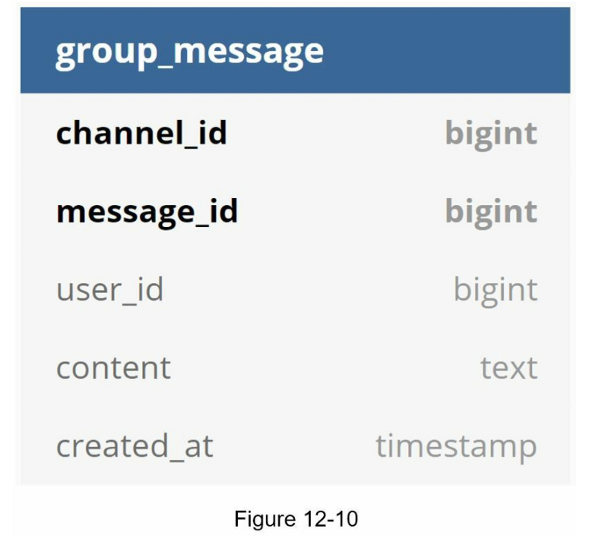

**message_id**
1. unique
2. 按时间排序

mysql auto_increment
uuid64
本地序列号生成器：ID只在一个组内是唯一的

## 深入设计

服务发现、消息流、在线/离线

### 服务发现 service discovery

e.g. Apache zookeeper
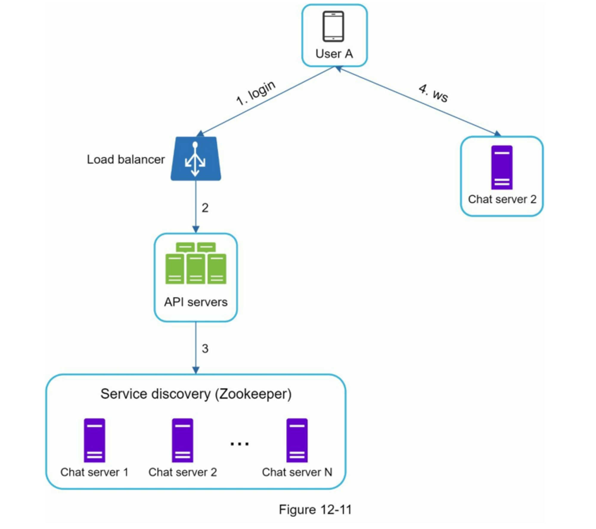

1. 用户A尝试登录APP
2. 负载均衡器发送登录请求到API服务
3. 在后端认证用户后，服务发现为用户A找到最佳的聊天服务器。在这个例子中，服务器2被选中，服务器信息被返回给用户A。
4. 用户A通过 WebSocket 连接到聊天服务器2。

### 消息流

#### 私聊

1. 用户A向聊天服务器1发送了一条聊天信息。
2. 聊天服务器1从ID生成器获得一个信息ID。
3. 聊天服务器1将消息发送至消息同步队列。
4. 消息被储存在一个键值存储中。
5. a. 如果用户B在线，信息被转发到用户B所连接的聊天服务器2。
6. b. 如果用户B处于离线状态，则从推送通知（PN）服务器发送推送通知。
7. 聊天服务器2将消息转发给用户B，用户B和聊天服务器2之间有一个持久的WebSocket连接。

#### 多设备间信息同步

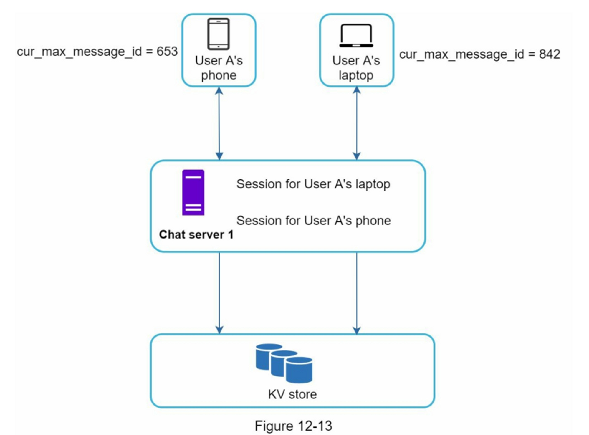

每个设备都维护着一个叫做cur_max_message_id的变量，它记录着设备上最新的消息ID。满足以下两个条件的消息被认为是新消息。

- 收件人ID等于当前登录的用户ID。
- 键值存储中的消息ID大于cur_max_message_id

由于每个设备上都有不同的cur_max_message_id，信息同步很容易，因为每个设备都可以从KV Store获得新的信息。

#### 群聊

用户A在群聊中发送消息：
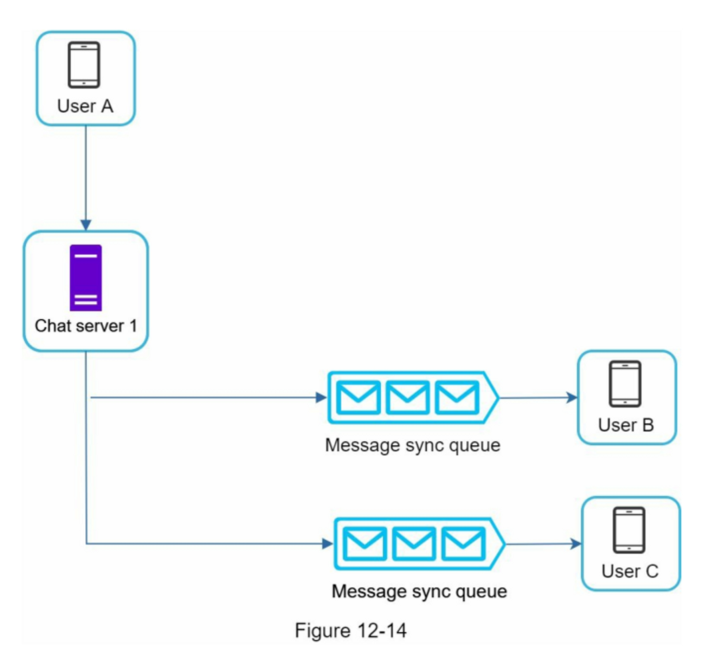

用户A的消息被复制到每个组员的消息同步队列中：一个给用户B，另一个给用户C。
消息同步队列类似于收件箱：
- 简化了信息同步流程，因为每个客户只需要检查自己的收件箱就可以获得新的信息。
- 当**群组人数较少**时，在每个收件人的收件箱中存储一份副本并不太昂贵

微信使用类似的方法，它将一个群组限制在500个成员[8]。然而，对于拥有大量用户的群组来说，为每个成员存储一份信息副本是不可接受的

对于收件人来说：
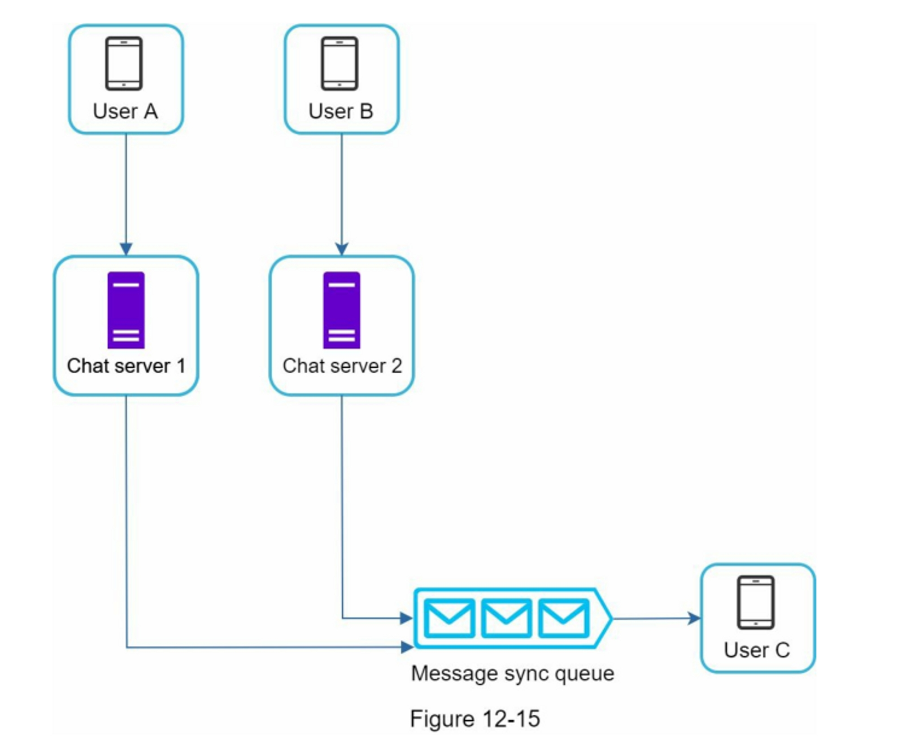

#### 在线状态

presense server （websocket）

##### 登录
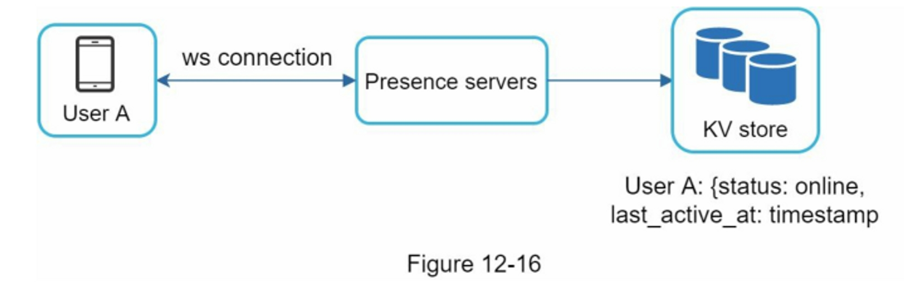
用户登录时执行[服务发现](设计一个聊天系统.md#服务发现%20service%20discovery)流程，建立ws连接后，用户A的在线状态和最后活动时间戳被保存在KV存储中。状态指示器显示用户在登录后处于在线状态

##### 登出
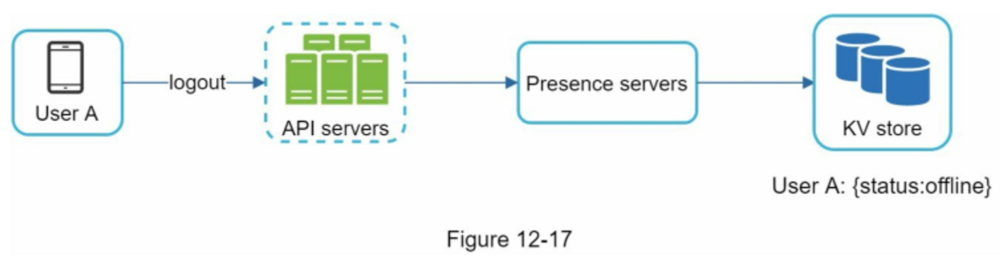
KV store 中在线状态变为离线状态。 状态指示器显示用户离线

##### 断开连接
当用户断开连接时，将用户标记为离线
这样做有重大问题：如果用户网络不稳，频繁断线，会导致在线状态变化频繁，体验不佳

用**心跳机制**解决问题：定期地，一个在线客户端向状态服务器发送一个心跳事件。如果状态服务器在一定时间内收到心跳事件，比如说来自客户端的X秒，那么用户被认为是在线的。否则，它就处于离线状态。

e.g. 客户端每5秒向服务器发送一个心跳事件。在发送了3个心跳事件后，客户端被断开连接，并且在x=30秒内没有重新连接（这个数字是任意选择的，以演示逻辑）。在线状态被改变为离线

##### 在线状态输出
使用**发布订阅**模式
每个朋友对（pair）都维护一个频道。 当用户A的在线状态发生变化时，将事件发布到三个频道，频道A-B，A-C，A-D。 这三个频道分别由用户 B、C 和 D 订阅
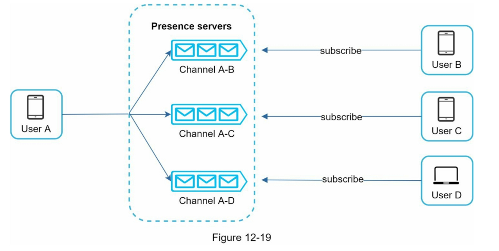
限制：群组不能太大 eg 微信