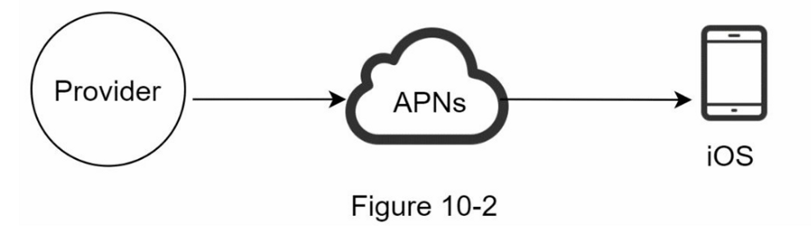
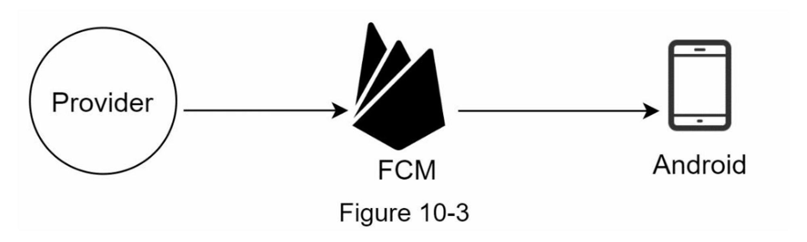
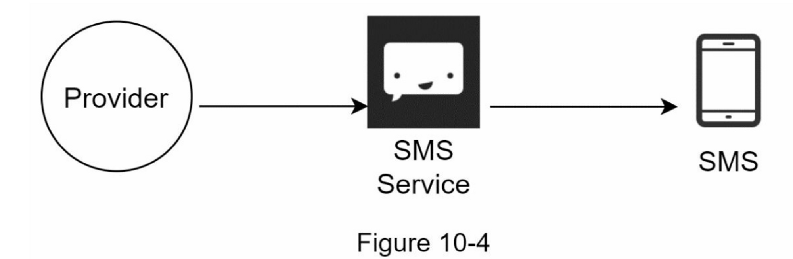
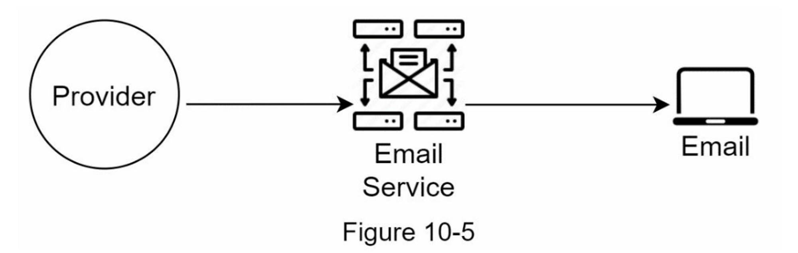
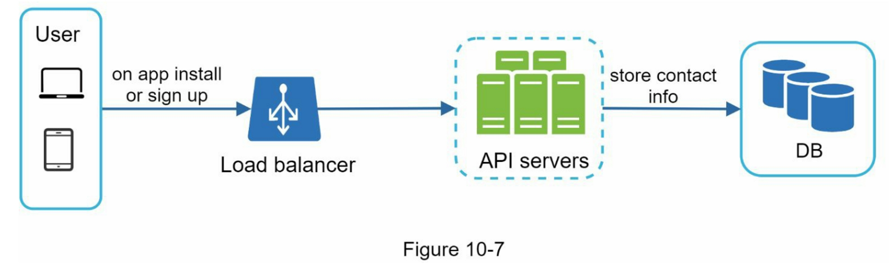
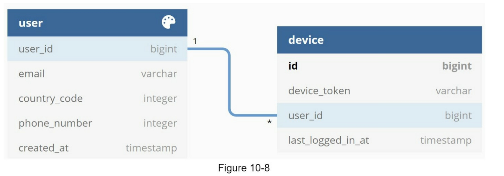
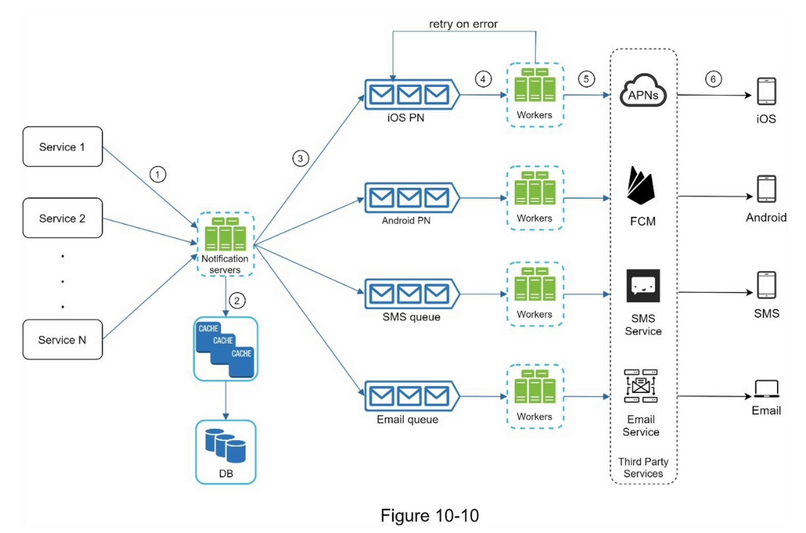
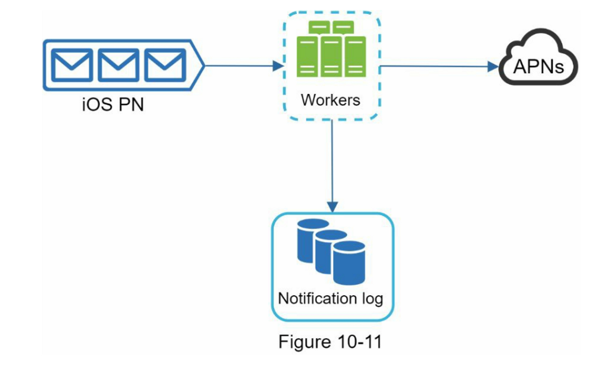
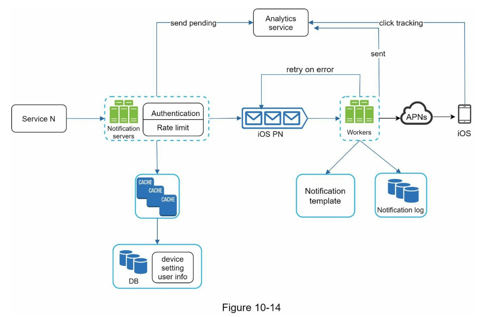

# 设计一个通知系统 notification

## 需求

支持推送、短信、邮件
软实时系统：尽量实时推送，可以接受高负荷下延迟
支持设备：移动端和pc
由客户端应用程序触发，也可以由服务器端调度
用户可选择退订
每日1000万条移动推送通知，100万条短信，500万封电子邮件

## 高层次设计

### 客户端，短信和邮件推动都依赖第三方或官方服务商提供服务
#### iOS 推送通知



Provider： 
1. 设备 token：这是用于发送推送通知的唯一标识符。
2. 有效载荷：是一个包含通知有效载荷的 JSON 字典。 例子：
    ```
    {
        "aps": {
            "alert": {
                "title": "Game Request",
                "body": "Bob wants to play chess",
                "action-loc-key": "PLAY"
            },
            "badge": 5
        }
    }
    ```

APNS： 苹果推送通知服务，由苹果官方提供

#### Android



#### SMS

使用第三方SMS服务，如Twilio[1]、Nexmo[2]和其他许多服务



#### Email

公司可以设置自己的电子邮件服务器，但其中许多公司选择商业电子邮件服务



### 联系人信息收集

用户安装我们的应用程序或首次注册时，API服务器收集用户设备token，电话或邮件地址



存储数据表：


### 通知发送/接收流程



- **Service 1 to N**: 一个微服务，一个cron job，或者一个触发通知发送事件的分布式系统。e.g. 计费服务提醒付款，购物网站提醒物流

- **Notification servers**： 
	- 为服务提供发送通知的API。这些API只能由内部或经过验证的客户访问，以防止垃圾邮件。
	- 进行基本验证，以核实电子邮件、电话号码等。
	- 查询数据库或缓存以获取渲染通知所需的数据。
	- 将通知数据放到消息队列中进行并行处理。

- **缓存**：用户信息、设备信息、通知模板都被缓存了。
    
- **数据库**：它存储了关于用户、通知、设置等方面的数据。
    
- **消息队列**：它们消除了组件之间的依赖性。当大量的通知被发送出去时，消息队列可以作为缓冲区。每种通知类型都被分配了一个不同的消息队列，所以一个第三方服务的中断不会影响其他通知类型。
	
- **Workers**：Workers 是一组服务器，它们从消息队列中拉取通知事件并将它们发送到相应的第三方服务。
    
- **第三方服务**
    
- **iOS, Android, SMS, Email

## 深入设计

### 可靠性

**防止数据丢失**： 将通知数据持久化到通知日志数据库，并添加重试机制



**减少重复**： 检查事件的ID来检查它是否在之前出现过

### 其他因素

通知模板，
用户通知设置，
限制通知速率， 
重试机制，
验证用户身份appKey和appSecret
监控排队通知以免worker超负荷，
事件跟踪分析用户行为

### 最终设计

