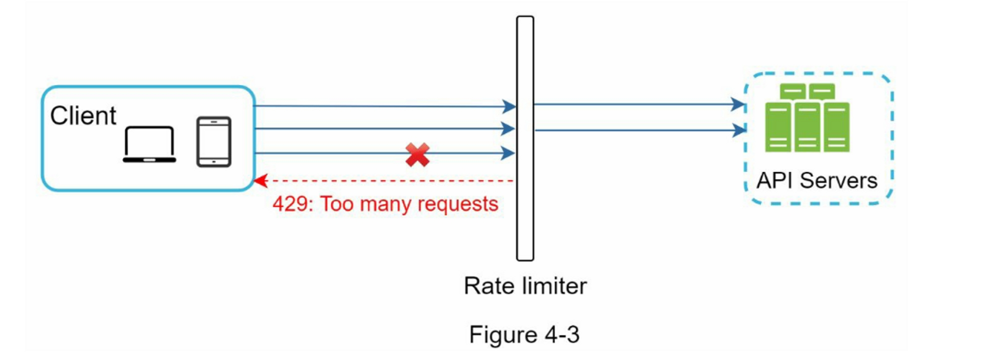
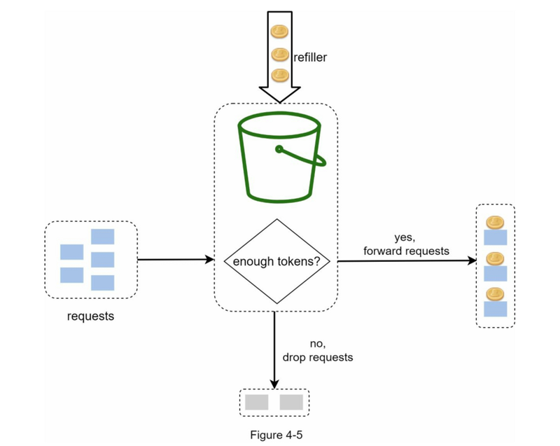
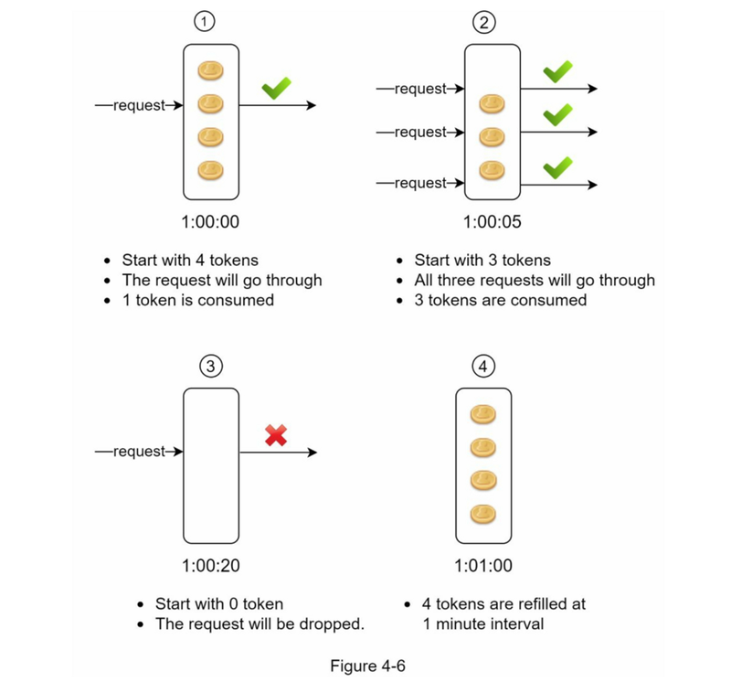
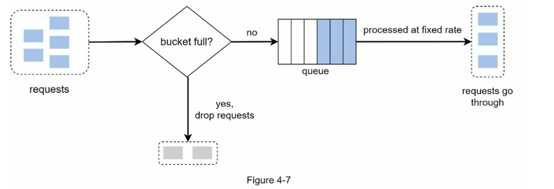
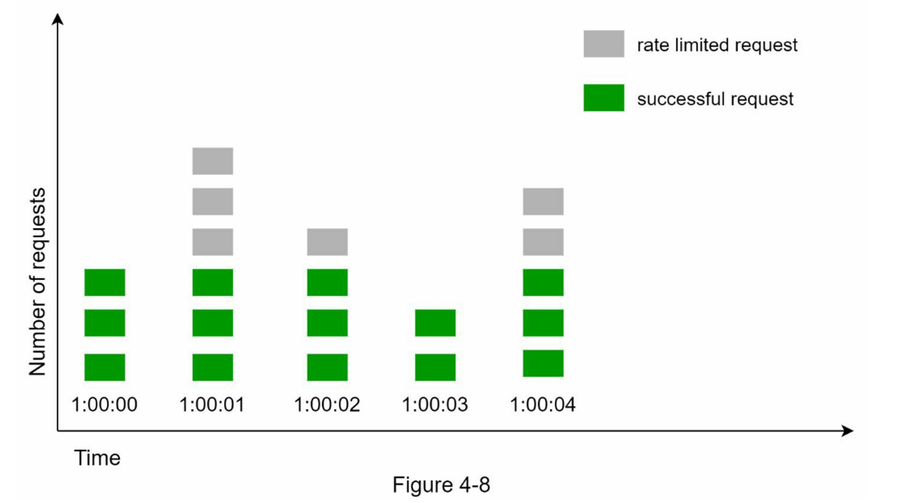
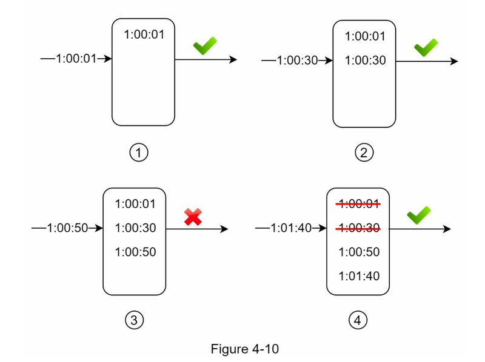
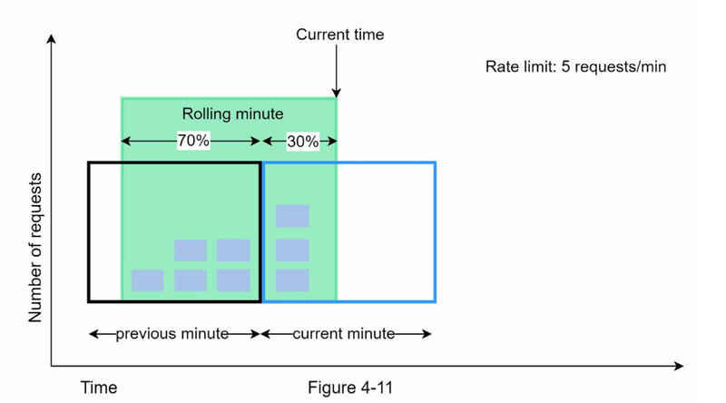
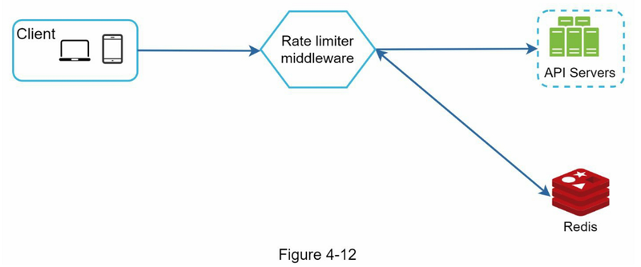
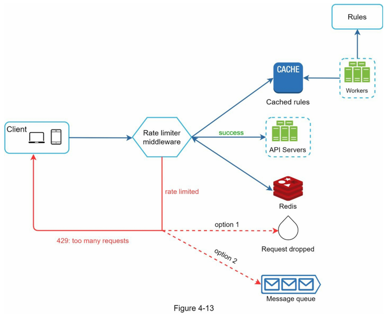

# 设计一个限流器

限流器限制在指定时间内允许发送客户端请求数。 如果API请求次数超过了限流器设置的阈值，则所有超出的调用都会被阻止。 以下是一些示例：

- 单个用户每秒最多可以发布2个帖子
- 每天同一IP地址最多可以创建10个帐户。
- 同一设备每周最多可以领取5次奖励。

用处：防止ddos，降低成本，防止过载

## 1. 确定需求

客户端 or 服务端
根据什么规则限制api req? IP, user id, ...
规模
分布式？
嵌入应用内还是独立模块？

## 2. 高层次设计

限流通常在一个叫做**API网关**的组件中实现。API网关是一个完全托管的服务，支持限速、SSL、认证、IP白名单、服务静态内容等

可以实现在api网关，服务器端，具体看技术栈和现实情况

### 限流算法

- 令牌桶（Token bucket）
- 漏桶算法（Leaking bucket）
- 固定窗口计数器（Fixed window counter）
- 滑动窗口日志（Sliding window log）
- 滑动窗口计数器（Sliding window counter）

#### 令牌桶（Token bucket）

令牌桶是一个具有预定义容量的容器。 令牌会以预定的速率定期放入桶中， 一旦桶满了，就不再添加令牌。

每个请求都会消耗一个令牌。当一个请求到达时，我们检查桶中是否有足够的令牌
- 如果有足够的令牌，我们会为每个请求取出一个令牌，然后请求通过。
- 如果没有足够的令牌，则该请求被丢弃。

令牌消耗、重新填充和速率限制逻辑的工作原理。 在此示例中，令牌桶大小为 4，重新填充速率为每 1 分钟 4 个：

**参数**： 桶大小，填充速率
**优点**
- 算法容易实现
- 占用内存少
- 令牌桶允许在短时间内进行突发流量。只要有剩余的令牌，请求就可以通过。
**缺点**
- 算法中有两个参数，即桶的大小和令牌的补充速率。参数不好调教

#### 漏桶 （leaking bucket）

FIFO queue
- 当请求到达时，系统会检查队列是否已满。如果队列未满，则将请求添加到队列中。
- 否则，将丢弃该请求。
- 请求会在固定的时间间隔内从队列中取出并进行处理。

**参数**：桶大小，流出速率

**优点：**
- 鉴于队列大小有限，内存效率高。
- 请求以固定的速率处理，因此它适用于需要稳定流出速率的用例。

**缺点：**
- 突发的流量使队列中充满了旧的请求，如果这些请求没有得到及时处理，最近的请求将受到速率限制。
- 算法中有两个参数，要适当地调整它们可能并不容易。

#### 固定窗口计数器

- 该算法将时间轴划分为固定大小的时间窗口，并为每个窗口分配一个计数器。
- 每个请求将计数器增加一。
- 一旦计数器达到预定的阈值，新的请求就会被放弃，直到新的时间窗口开始。

e.g. 时间单位是1秒，系统允许每秒钟最多有3个请求。在每个秒窗口中，如果收到的请求超过3个，额外的请求就会被放弃

**优点：**
- 内存高效
- 容易理解
- 在单位时间窗口结束时重新设置可用配额，适合某些使用情况
**缺点：**
- 窗口边缘的流量激增可能导致超过允许配额的请求被通过（有突刺）:在窗口交界处卡bug

#### 滑动窗口日志算法

- 该算法对请求的时间戳进行跟踪。时间戳数据通常保存在缓存中，如Redis的sorted[8] 。
- 当一个新的请求进来时，删除所有过期的时间戳。过时的时间戳被定义为比当前时间窗口的开始时间更早的时间戳。
- 将新请求的时间戳添加到日志中
- 如果日志大小与允许的计数相同或更低，则接受请求。否则，它将被拒绝

**优点：**
- 这种算法实现的速率**限制是非常准确**的。在任何滚动窗口中，请求都不会超过速率限制。
**缺点：**
- 该算法消耗了大量的内存，因为即使一个请求被拒绝，其时间戳仍可能被存储在内存中

#### 滑动窗口计数器

结合了固定窗口计数器和滑动窗口日志

假设限流器允许每分钟最多有7个请求，在上一分钟有5个请求，当前一分钟有3个请求。对于在当前分钟内到达30%位置的新请求，滚动窗口中的请求数用以下公式计算：
- **当前窗口中的请求数量 + 上一个窗口中的请求数量 * 滚动窗口和上一个窗口的重叠百分比**
- 使用这个公式，我们得到3 + 5 * 0.7% = 6.5个请求。根据不同的使用情况，这个数字可以向上或向下取整。在我们的例子中，它被向下四舍五入为6。
由于限流器每分钟最多允许7个请求，当前的请求可以通过。然而，再收到一个请求后，就会达到限制。

**优点：**
- 它平滑了流量的峰值，因为速率是基于前一个窗口的平均速率。
- 内存高效
**缺点：**
- 它只适用于不太严格的回看窗口。它是实际速率的近似值，因为它假设前一个窗口的请求是均匀分布的。然而，这个问题可能并不像它看起来那么糟糕。 根据Cloudflare[10]所做的实验，在4亿个请求中，只有0.003%的请求被错误地允许或限制速率

### 架构

需要一个**计数器**来跟踪来自同一用户、IP地址等的多少个请求。如果计数器大于限制值，则请求被禁止。

用**内存缓存**存储计数器： Redis

- 客户端向限流中间件发送请求
- 限流中间件从Redis中相应的桶中获取计数器，并检查是否达到限制
    - 如果达到限制，则拒绝该请求
    - 如果没有达到限制，请求会被发送到API服务器。同时，系统会增加计数器并将其保存回Redis。

## 3. 深入设计

- 规则被存储在磁盘上。工作者经常从磁盘中提取规则，并将其存储在高速缓存中。
- 当客户端向服务器发送请求时，该请求首先被发送到限流中间件。
- 限流中间件从缓存中加载规则。它从Redis缓存中获取计数器和最后一次请求的时间戳。根据响应，限流器决定：
    - 如果请求没有速率限制，它将被转发到API服务器。
    - 如果请求受到速率限制，限流器会向客户端返回 429 too many requests 错误。 同时，请求被丢弃或转发到队列。